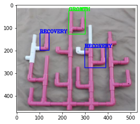

# Coral-Colony-Health

  

Welcome to the Coral Colony Health Monitoring project! This initiative is dedicated to assessing and preserving the health of coral colonies in marine ecosystems. By utilizing advanced image processing technologies and data analysis, this project aims to contribute to the conservation of coral reefs and marine biodiversity.
